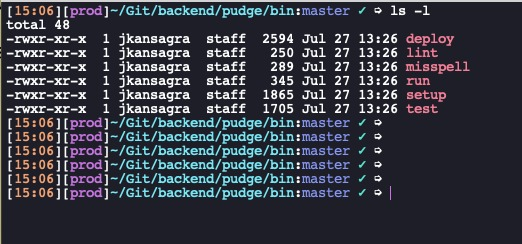

# kube-zsh-theme
An ohmyzsh theme, intended to work with Kubernetes kubectl context. This theme adapts your console to the MacOS.

You can find this theme in the official <a href="https://github.com/ohmyzsh/ohmyzsh/wiki/External-themes#macos-terminal">**Github Wiki**</a> of Oh My ZSH.
- Tested on MacOS

## Features
- shows the current time
- shows current kubectl context
- shows current dir
- shows current Git branch
- shows an arrow to differentiate input vs prompt
- uses different colors for readability

## Installation
1. Write in your terminal `git clone https://github.com/tigerjz32/kube-zsh-theme.git/ $ZSH_CUSTOM/themes/kube-zsh-theme`
1. Open your `.zshrc`
1. Change your `ZSH_THEME` to `kube-zsh-theme/kube`

## Format
`[CURRENT_TIME][CURRENT_KUBECTL_CONTEXT][CURRENT_DIR][GIT_PRMOPT_INFO]➭$`
